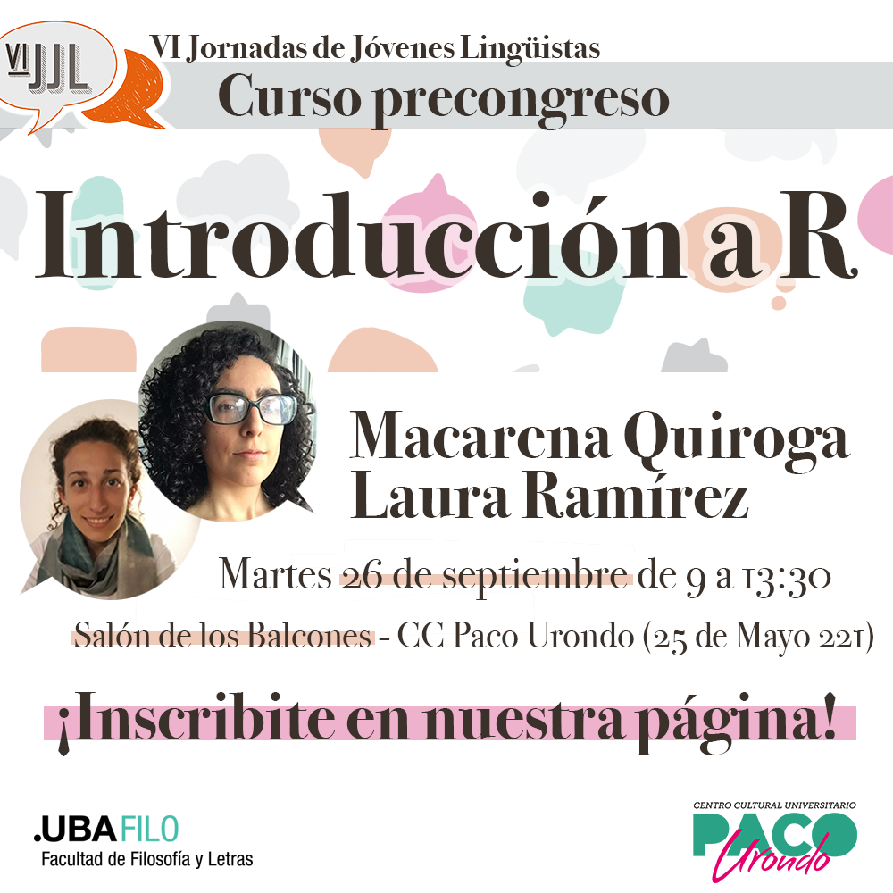

# Curso precongreso "Introducción a R"

¡Hola!

Este es el repositorio oficial del curso pre-congreso "Introducción a R", a dictarse en el marco de las VI Jornadas de Jóvenes Lingüistas, a cargo de Macarena Quiroga y Laura Ramírez. Aquí vas a encontrar los siguientes elementos:

-   Los scripts vacíos que vamos a usar durante el curso

-   El material completo, en un PDF

-   La base de datos con la que vamos a trabajar

Podés encontrar más recursos para aprender R en [mi sitio web](https://macarenaquiroga.com/). Cualquier consulta no dudes en escribirme a hola\@macarenaquiroga.com
